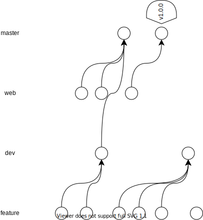

## Структура репозитория
В качестве модели репозитория используется упрощённая версия git flow  
Основная разработка ведётся в ветке dev. Тестирование отдельных возможностей производится в ветке feature.   
Все разработчики могут создавать ветки по своему усмотрению, придерживаясь нейминга: `feature/ui/login-form`, соответственно:
 - feature - рабочая ветка
 - ui - компонент решения
 - login-form - непосредственно часть кода/возможность, над которой ведется работа

Отдельно идёт работа с веткой `web`, которая предназначена испключительно для слияния изменений в master ветку.

Релизы версий осуществляются в тегах, формат названия тега стандартный:  
`vA.B.C`, где
 - A - основная версия
 - B - подверсия
 - C - ревизия

Ветка `master` защищена от возможности внесения изменений разработчиками и слияния без разрешения руководителя проекта

## Разграничение прав
#### Руководитель проекта
 - Проводит ревью pull request'ов, которые необходимо слить в master-ветку 
 - Занимается формированием релизов

#### Разработчик
 - Занимается написанием кода в ветках feature, может производить слияние с веткой dev без разрешения руководителя
 - Самостоятельно тестирует функционал своей ветки, по возможности просит это делать тестировщика

#### Тестировщик
 - Тестировшику не рекомендуется вносить изменения в код других разработчиков.
 - Занимается тестированием ветки dev и, при запросе, ветки разработчиков (feature)

#### Документовед
 - Отвечает за поддержание в актуальном состоянии Wiki проекта

#### Заказчик
 - Не имеет прав записи в репозиторий, но имеет права на чтение любых веток
 - В первую очередь заказчика интересют master ветки и теги с релизами, где имеется стабильный функционал

## Диаграмма структуры
